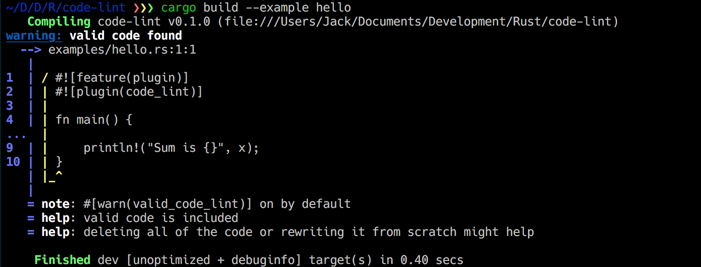

# Rust linting

Ever been writing code, and just _really_ wanted the compiler to start yelling at you?  Well, now its easy, `code-lint` will lint against any code you have, just so you can have yet another warning.



# Usage

To use, just add `code-lint` to your dependencies

```toml
code-lint = { git = "https://github.com/Noskcaj19/code-lint.git" }
```

And then enable the linting plugin

```rust
#![feature(plugin)]
#![plugin(code_lint)]
```

Now Rust will complain about _all_ your code
